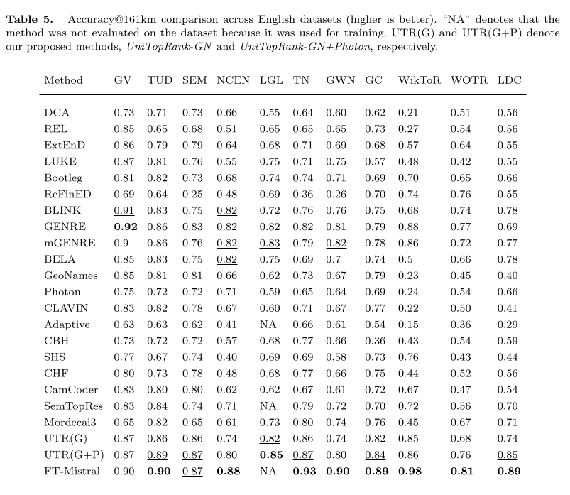
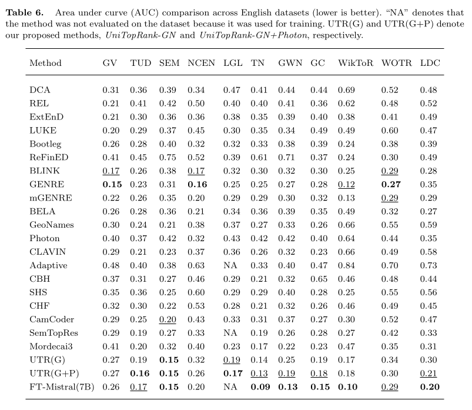
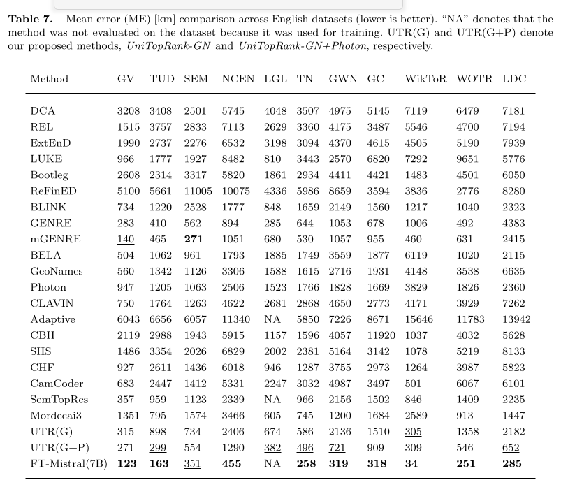
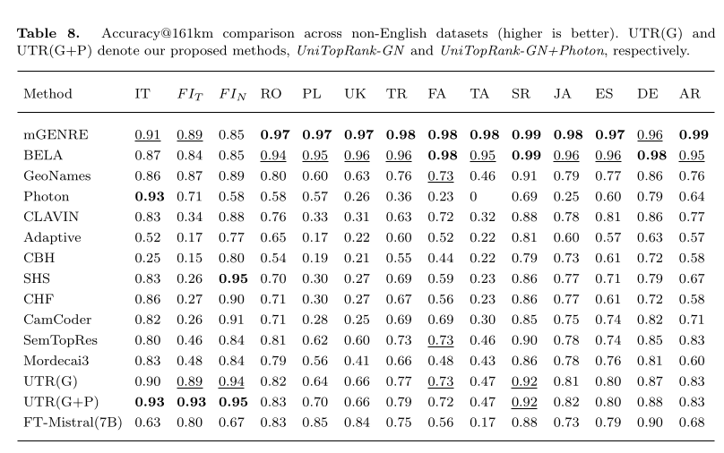
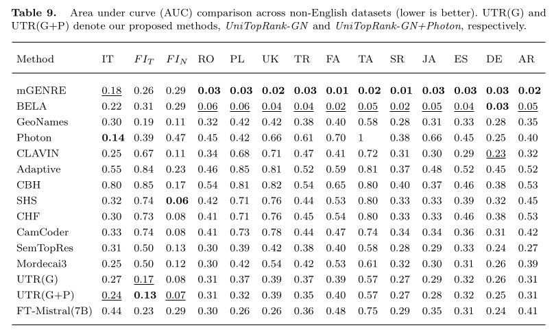
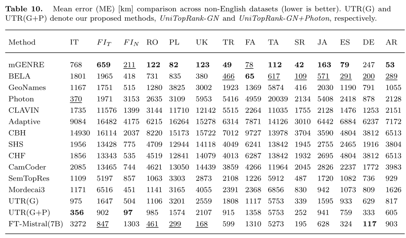

# UniTopRank

UniTopRank is a fast, CPU-friendly, multilingual toponym resolution method that combines name similarity, administrative level, population, and spatial coherence between toponyms in the same document. Although its theoretical upper bound is typically lower than the most advanced model-heavy approaches (for example, strong LLM-based systems), it is much faster, easier to deploy, and our extensive evaluations show that it achieves competitive accuracy while outperforming many heavily trained deep learning baselines.


Application class:

This repository targets Application Class 1 research software for public release.

Suitable for:

- large-scale or near real-time geoparsing where speed matters
- CPU-only or resource-constrained environments
- multilingual deployments without training language-specific geocoders
- production scenarios requiring interpretable, stable rule-based behavior
- strong baseline systems before adding heavier neural/LLM components

You can use the code in two ways:

1. Full geoparsing pipeline: `NER -> candidate retrieval -> ranking`
2. Direct ranking API: provide toponyms and candidate sets directly (lightweight integration)

## Prerequisites

Python `>=3.8`.

## Environment Setup (Full Commands)

Run these commands from terminal:

```bash
# Run all commands inside the `api/` folder.

# 1) Create virtual environment
# Note: using /tmp avoids path issues with ':' in mounted directories.
python3 -m venv /tmp/unitoprank_venv

# 2) Activate virtual environment
source /tmp/unitoprank_venv/bin/activate

# 3) Upgrade packaging tools
pip install --upgrade pip setuptools wheel

# 4) Install project dependencies
pip install -r requirements.txt

# 5) Optional: install NER backends (stanza/flair)
pip install -r requirements-ner.txt
```

To deactivate:

```bash
deactivate
```

If you prefer a different environment path, replace `/tmp/unitoprank_venv` with your own path.

## Quick Install (if venv already active)

```bash
pip install -r requirements.txt
```

`requirements.txt` and `requirements-ner.txt` are pinned (`==`) for deterministic/reproducible installs.

Optional NER packages:

```bash
pip install -r requirements-ner.txt  # stanza + flair; install only if using these backends
```

NER support notes:

- Stanza and Flair both support multilingual NER, but coverage depends on the specific language/model installed.
- For toponym extraction, this code accepts labels: `LOC`, `GPE`, `LOCATION`, and `FAC` (including BIOES variants such as `B-LOC`, `I-LOC`, `B-FAC`, `I-FAC`).
- `flair_model` is used only when `ner_backend="flair"`. It is ignored for `stanza`.
- Stanza language is set per call via `pipeline.parse(text=..., language="xx")`. If omitted, default is `"en"`.
- For Flair, do not pass a `language` argument to `parse(...)`; language behavior is determined by the selected `flair_model`.
- The first run with a new Stanza language or Flair model can take longer because model files may need to be downloaded and loaded; later runs are usually faster due to caching.

For Stanza, make sure each language model is downloaded first (example for German and French):

```python
import stanza
stanza.download("de", processors="tokenize,ner")
stanza.download("fr", processors="tokenize,ner")
```

Flair model options:

- You can choose any Flair `SequenceTagger` model id via `GeoparsingConfig(flair_model=...)`.
- Fast multilingual: `flair/ner-multi-fast`
- More accurate multilingual: `flair/ner-multi`
- Fast English: `flair/ner-english-fast`
- More accurate English: `flair/ner-english-large`
- Fast English (OntoNotes): `flair/ner-english-ontonotes-fast`
- More accurate English (OntoNotes): `flair/ner-english-ontonotes-large`

Language selection examples:

```python
from geoparsing_api import GeoparsingConfig, GeoparsingPipeline

# Stanza: choose language per parse() call
stanza_pipeline = GeoparsingPipeline.from_config(
    GeoparsingConfig(
        ner_backend="stanza",
        fill_missing_candidates_with_retriever=False,  # no external candidate service for this language demo
    )
)
stanza_pipeline.parse(text="Ich war in Berlin.", language="de", candidates_by_toponym={})
stanza_pipeline.parse(text="Je suis a Paris.", language="fr", candidates_by_toponym={})

# Flair: choose language/model via flair_model; no need to pass language to parse()
flair_pipeline = GeoparsingPipeline.from_config(
    GeoparsingConfig(
        ner_backend="flair",
        flair_model="flair/ner-multi-fast",  # multilingual
        fill_missing_candidates_with_retriever=False,  # no external candidate service for this language demo
    )
)
flair_pipeline.parse(text="Ich war in Berlin.", candidates_by_toponym={})

# Example for English-only model:
english_flair_pipeline = GeoparsingPipeline.from_config(
    GeoparsingConfig(
        ner_backend="flair",
        flair_model="flair/ner-english-large",
    )
)
```

## Candidate Retrieval Services

Candidate retrieval is required before ranking.  
For normal usage, deploy candidate services first:

1. Deploy GeoNames server: [GeoNames deployment guide](https://github.com/amagge/geonames-service)
2. Optionally deploy Photon server: [Photon deployment guide](https://github.com/komoot/photon)

Default endpoints used by this code:

- GeoNames: `http://localhost:8091/location?location=`
- Photon: `http://localhost:2322/api/?q=`

For colleagues inside the DLR network, you can use the internally deployed services:

- GeoNames host: `http://dw-mir-postgis.intra.dlr.de:8091/location?location=`
- Photon host: `http://photon.intra.dlr.de:2322/api/?q=`

If these servers are not running, full pipeline retrieval cannot work.

Even when using the direct ranking API, you still need candidates from GeoNames/Photon (or an equivalent source) before calling the ranker.

## Server Address Configuration (GeoNames / Photon)

You can configure server endpoints and ranking parameters in one place:

```python
from geoparsing_api import (
    GeoparsingConfig,
    GeoparsingPipeline,
    CandidateRetrieverConfig,
    RankerConfig,
)

cfg = GeoparsingConfig(
    ner_backend="stanza",
    ranker=RankerConfig(
        top_n=17,                    # number of ranked candidates kept per toponym
        base_spatial_weight=0.3,     # base strength of spatial coherence signal
        weight_similarity=0.3,       # weight for name similarity score
        weight_level=0.1,            # weight for admin-level score (e.g., PPLC, ADM1)
        weight_population=0.2,       # weight for population-based score
        distance_threshold_km=300,   # distance scale (km) for spatial score decay
        sp_score_type=2,             # spatial scoring curve type (0/1/2)
        max_population=20_000_000,   # normalization cap for population scoring
    ),
    candidate_retriever=CandidateRetrieverConfig(
        geonames_enabled=True,
        photon_enabled=True,          # set False if Photon is not deployed
        geonames_url="http://localhost:8091/location?location=",  # replace with your GeoNames endpoint
        photon_url="http://localhost:2322/api/?q=",               # replace with your Photon endpoint
        geonames_limit=50,            # fuzzy-fill target; exact-name matches are kept even if > 50
        photon_limit=300,             # number requested from Photon endpoint
        deduplicate_by_address=False, # keep records even if address text repeats
    ),
)

pipeline = GeoparsingPipeline.from_config(cfg)
```

If you want Flair NER instead:

```python
from geoparsing_api import GeoparsingConfig

cfg = GeoparsingConfig(
    ner_backend="flair",
    flair_model="flair/ner-multi-fast",
)
```

## Usage Path A: Full Pipeline

Use this path when you want end-to-end geoparsing from raw text.

```python
from geoparsing_api import GeoparsingConfig, GeoparsingPipeline, CandidateRetrieverConfig

cfg = GeoparsingConfig(
    ner_backend="stanza",
    candidate_retriever=CandidateRetrieverConfig(
        geonames_enabled=True,
        photon_enabled=True,
        geonames_url="http://localhost:8091/location?location=",
        photon_url="http://localhost:2322/api/?q=",
    ),
)

pipeline = GeoparsingPipeline.from_config(cfg)

text = "I visited Paris, a city in Texas, United States."
result = pipeline.parse(text=text, language="en")
print("EN:")
for mention in result["mentions"]:
    best = mention["top1_candidate"]
    print(mention["text"], "->", best["address"] if best else None)

text = "Ich habe Paris besucht und bin dann nach Berlin geflogen."
result = pipeline.parse(text=text, language="de")
print("\nDE:")
for mention in result["mentions"]:
    best = mention["top1_candidate"]
    print(mention["text"], "->", best["address"] if best else None)
```

For Flair in this same flow, switch backend and set model explicitly:

```python
from geoparsing_api import GeoparsingConfig, CandidateRetrieverConfig

cfg = GeoparsingConfig(
    ner_backend="flair",
    flair_model="flair/ner-multi-fast",
    candidate_retriever=CandidateRetrieverConfig(
        geonames_enabled=True,
        photon_enabled=True,
        geonames_url="http://localhost:8091/location?location=",
        photon_url="http://localhost:2322/api/?q=",
    ),
)
```

## How To Obtain Candidates From Toponyms

If you follow `Usage Path B`, this is the simple candidate-fetch step before calling `resolve_toponyms(...)`:

```python
from geoparsing_api import CandidateRetriever, CandidateRetrieverConfig

# use the same `mentions` list built in Usage Path B

retriever = CandidateRetriever(
    CandidateRetrieverConfig(
        geonames_enabled=True,
        photon_enabled=True,
        geonames_url="http://localhost:8091/location?location=",
        photon_url="http://localhost:2322/api/?q=",
    )
)

candidates_by_toponym = retriever.get_candidates_for_toponyms([m["LOC"] for m in mentions])
```

`candidates_by_toponym` from this step can be passed directly into `resolve_toponyms(...)`.

## Usage Path B: Direct Ranking API (Short Example)

Use this path when you already have:

1. text
2. toponyms with character offsets, obtained from your own toponym recognizer
3. candidates for each toponym

```python
from geo_rank_api import resolve_toponyms
import re

text = "Ich habe Paris besucht und bin dann nach Berlin geflogen."
toponym_strings = ["Paris", "Berlin"]
mentions = []
for loc in toponym_strings:
    m = re.search(r"\b{}\b".format(re.escape(loc)), text)
    if m:
        mentions.append({"LOC": loc, "start": m.start(), "end": m.end()})

candidates = {
    "paris": [
        {
            "address": "Paris, Ile-de-France, France, Europe",
            "lat": 48.8566,
            "lon": 2.3522,
            "name": "Paris",
            "alt_names": ["Parigi", "París", "Parijs"],
            "admin_level": "PPLC",
            "population": 2140526,
        },
        {
            "address": "Paris, Lamar County, Texas, United States, North America",
            "lat": 33.6609,
            "lon": -95.5555,
            "name": "Paris",
            "alt_names": [],
            "admin_level": "PPLA2",
            "population": 24719,
        },
    ],
    "berlin": [
        {
            "address": "Berlin, Germany, Europe",
            "lat": 52.5200,
            "lon": 13.4050,
            "name": "Berlin",
            "alt_names": ["Berlino", "Berlín", "Berlim"],
            "admin_level": "PPLC",
            "population": 3644826,
        },
        {
            "address": "Berlin, Coos County, New Hampshire, United States, North America",
            "lat": 44.4684,
            "lon": -71.1837,
            "name": "Berlin",
            "alt_names": [],
            "admin_level": "PPL",
            "population": 10050,
        },
    ],
}

resolved_mentions, ranked_results = resolve_toponyms(
    text=text,
    mentions=mentions,
    candidates_by_toponym=candidates,
    top_n=10,
    distance_threshold_km=300,
)

for m in resolved_mentions:
    print(m["LOC"], "->", m.get("lat"), m.get("lon"), m.get("address"))

print(ranked_results["paris"][:3])
```

If your mentions use `"text"` instead of `"LOC"`, call:

```python
resolved_mentions, ranked_results = resolve_toponyms(
    text=text,
    mentions=[{"text": "Paris", "start": text.index("Paris"), "end": text.index("Paris") + len("Paris")}],
    candidates_by_toponym=candidates,
    loc_key="text",
)
```

Alternative names (`alt_names`):

- Provide language/name variants when available (for example: `["Parigi", "París", "Parijs"]`).
- Do not use admin abbreviations as aliases (for example avoid `Berlin NH`, `Paris TX` in `alt_names`).
- You can also use `alternative_names`; the API maps it to `alt_names`.

Address field (`address`):

- This is important for ranking, because hierarchy similarity is derived from address components.
- Use a clean hierarchy string with `", "` separators.
- Put smaller unit first, then broader regions.
- Typical order: `city, county/region, state/province, country, continent`.

## Comparative Results

### English datasets







### Non-English datasets







For full experimental settings, dataset details, and complete method description, please refer to our paper.

## Citation

If you refer to UniTopRank in a publication, please cite:

Hu, X., Sun, Y., Hecking, T., Kersten, J., & Klan, F. (2026). *UniTopRank: A scalable and language-independent method for toponym resolution*. *International Journal of Geographical Information Science (IJGIS)*, accepted for publication.

## Contact

For questions or collaboration, contact: `xuke.hu@dlr.de`
